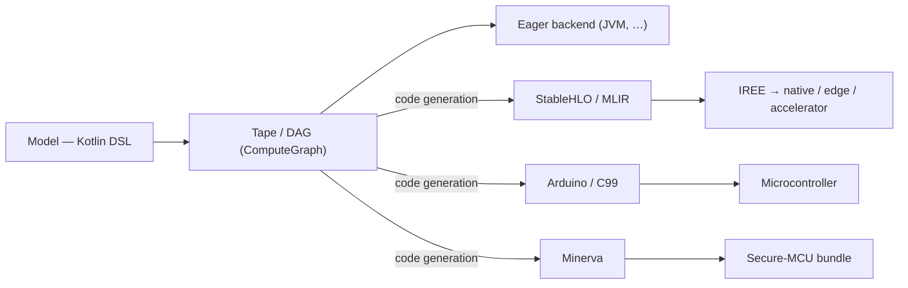

[](LICENCE)
[](https://central.sonatype.com/artifact/sk.ainet.core/skainet-lang-core)
[](https://api.reuse.software/badge/github.com/SKaiNET-developers/SKaiNET)
[](https://scorecard.dev/viewer/?uri=github.com/SKaiNET-developers/SKaiNET)
[](https://www.bestpractices.dev/projects/14004)


<a href="https://skainet-developers.github.io/SKaiNET/skainet/reference/architecture.html" title="Open the full architecture reference">
  
</a>

_Click the diagram for the full [architecture reference](https://skainet-developers.github.io/SKaiNET/skainet/reference/architecture.html), or read the short [ARCHITECTURE.md](ARCHITECTURE.md)._

---

## Start in 5 minutes

SKaiNET is a Kotlin Multiplatform AI framework. New here? Choose the path that
matches what you want to try first.

| Goal | Start here | Time |
|---|---|---:|
| Run tensor operations | [Quickstart](#quickstart) (below) | 2–5 min |
| Build and train a neural net | [Hello Neural Net](#hello-neural-net) (below) | 5 min |
| Run a local GGUF model | [SKaiNET Transformers starter](https://github.com/SKaiNET-developers/SKaiNET-transformers#start-in-5-minutes) | 5 min after model setup |
| Export a secure MCU bundle | [Minerva getting started](docs/modules/ROOT/pages/tutorials/minerva-getting-started.adoc) | 10 min without firmware flashing |

Working in Java? SKaiNET ships first-class Java support — see the
[Java getting-started guide](docs/modules/ROOT/pages/tutorials/java-getting-started.adoc).

> [!NOTE]
> **Looking for LLM inference?** Llama, Qwen, Gemma, Apertus, BERT embeddings and
> GGUF chat models live in
> [**SKaiNET-transformers**](https://github.com/SKaiNET-developers/SKaiNET-transformers) —
> this repository is the engine underneath it (tensors, NN DSL, compiler, CPU/native
> backends, GGUF/SafeTensors IO). Depend on the `sk.ainet.transformers` artifacts,
> pinned together by the
> [transformers BOM](https://central.sonatype.com/artifact/sk.ainet.transformers/skainet-transformers-bom).

Use the version shown in this README as the source of truth for first-run snippets.
If another page shows a different version, please open an issue or PR.

---

## Quickstart

Add the core dependencies (Gradle Kotlin DSL):

```kotlin
dependencies {
    // Recommended: import the umbrella BOM and drop versions on the engine modules.
    implementation(platform("sk.ainet:skainet-bom:0.54.0"))

    implementation("sk.ainet.core:skainet-lang-core")
    implementation("sk.ainet.core:skainet-backend-cpu")
}
```

### Hello Neural Net

```kotlin
val model = nn {
    input(28 * 28)
    dense(out = 128)
    relu()
    dense(out = 10)
}
```

### Core Tensor Ops

```kotlin
val a = tensor(shape(2, 2)) { float(1f, 2f, 3f, 4f) }
val b = tensor(shape(2, 2)) { float(5f, 6f, 7f, 8f) }

val c = a matMul b
val d = c.relu()
```

### GGUF Model Loading

```kotlin
// Recommended: streaming reader — memory-efficient, supports quantized types
val source = JvmRandomAccessSource.open("model.gguf")
StreamingGGUFReader.open(source).use { reader ->
    println("Tensors: ${reader.tensorCount}")

    // Load specific tensor on demand (no whole-file loading)
    val bytes = reader.loadTensor("token_embd.weight")

    // Or get a TensorStorage descriptor with encoding/placement metadata
    val storage = reader.loadTensorStorage("token_embd.weight")
}
```

> **More examples:** [SKaiNET-examples](https://github.com/SKaiNET-developers/SKaiNET-examples) | [SKaiNET-notebook](https://github.com/SKaiNET-developers/SKaiNET-notebook)

---

## Ecosystem

SKaiNET is a modular ecosystem. While this repository contains the core engine, specialized high-level libraries are maintained in standalone repositories:

| Project | Description |
|---|---|
| [SKaiNET-transformers](https://github.com/SKaiNET-developers/SKaiNET-transformers) | Pre-built transformer architectures and layers |
| [SKaiNET-examples](https://github.com/SKaiNET-developers/SKaiNET-examples) | Sample projects and integration demos |

---

## Explore

| Goal | Start here |
|---|---|
| Examples and sample projects | [SKaiNET-examples](https://github.com/SKaiNET-developers/SKaiNET-examples) |
| Interactive notebooks | [SKaiNET-notebook](https://github.com/SKaiNET-developers/SKaiNET-notebook) |
| Eager backends & kernels (what runs where) | [Backends & kernels map](docs/modules/ROOT/pages/explanation/eager-execution.adoc) |
| Design proposals and long-lived API decisions | [SKEEP proposals](docs/modules/skeep/pages/index.adoc) |
| Memory & storage architecture (storage, views, scopes, planning) | [The memory model](docs/modules/ROOT/pages/explanation/memory-model.adoc) · [Packed weight layout](docs/modules/ROOT/pages/explanation/packed-weight-layout.adoc) |

---

## Contributing and Design Proposals

**First time here?** Three links are all you need:

- 🚀 [Getting started as a contributor](https://skainet-developers.github.io/SKaiNET/skainet/contributing/getting-started.html) — the two workflows in one page, and how to claim a task.
- 🟣 [Open good first issues](https://github.com/SKaiNET-developers/SKaiNET/issues?q=is%3Aopen+label%3A%22good+first+issue%22) — filter further by what you know: [`skill:android`](https://github.com/SKaiNET-developers/SKaiNET/issues?q=is%3Aopen+label%3Askill%3Aandroid), [`skill:numerics` (no Kotlin)](https://github.com/SKaiNET-developers/SKaiNET/issues?q=is%3Aopen+label%3Askill%3Anumerics), [`skill:docs`](https://github.com/SKaiNET-developers/SKaiNET/issues?q=is%3Aopen+label%3Askill%3Adocs), or by size: [`size:xs`](https://github.com/SKaiNET-developers/SKaiNET/issues?q=is%3Aopen+label%3Asize%3Axs).
- 🏷️ [Issue taxonomy](https://skainet-developers.github.io/SKaiNET/skainet/contributing/issue-taxonomy.html) — what every label and `[Lane N · skill]` title prefix means.

Small fixes can go straight through the normal contribution flow described in
[CONTRIBUTING.md](CONTRIBUTING.md) and [GITFLOW.adoc](GITFLOW.adoc).

Non-trivial work goes through one of two processes:

- **DARC** (Document / Assess / Research / Code) for *one feature* — a new
  operator, metric, layer, format reader, or kernel strategy. A feature is one
  parent issue plus skill-labelled sub-issues ("lanes"). See the
  [DARC workflow](https://skainet-developers.github.io/SKaiNET/skainet/contributing/darc-workflow.html).
- **SKEEP** (SKaiNET Evolution and Enhancement Process) for *one architectural
  decision* — public APIs, DSL syntax, tensor semantics, compiler/runtime
  integration, storage behavior, compatibility policy. SKEEP files live under
  `docs/modules/skeep/pages/` with three-digit numbering. See the
  [SKEEP index](https://skainet-developers.github.io/SKaiNET/skainet/skeep/index.html).

---

## Official Benchmarks

SKaiNET ships an official Phoronix-Test-Suite-compatible benchmark
program for the compute engine. See the
[methodology and replay docs](docs/modules/ROOT/pages/contributing/benchmarks.adoc),
the [release manifest](benchmarks/manifests/engine-release.yml), and the
[CI workflow](.github/workflows/engine-benchmarks.yml). Smoke runs fire
on every PR via `ubuntu-latest`; full publishable runs fire on a
self-hosted Linux x86 runner on release.

Quick local replay:

```bash
./gradlew :skainet-backends:benchmarks:jvm-cpu-publish:shadowJar
./scripts/run_engine_smoke.sh
```

---

## Architecture goal

SKaiNET is built around one path: **a model is defined once in the Kotlin DSL,
then either compiled or executed eagerly — without rewriting it.**

1. **Define** the model with the DSL (`nn { }` / `dag { }`).
2. **Capture** it as a *tape* (traced execution) or a *DAG* (explicit graph) — a `ComputeGraph`.
3. **Run** it one of two ways:
   - **Compile** — lower the captured `ComputeGraph` through one of several
     **sibling code-generation backends**, each emitting code for a different target
     from the *same* graph:
     - **StableHLO / MLIR** (`HloGenerator`) → IREE-compilable, for native / edge /
       accelerator targets and the wider MLIR ecosystem.
     - **Arduino / C99** → standalone, statically-allocated C for microcontrollers.
     - **Minerva** → a secure-MCU bundle (weights + firmware skeleton + fingerprinted
       manifest).
   - **Eager** — execute directly on an available backend. On the **JVM this is
     the primary, go-to path.**

StableHLO/MLIR is therefore **one code-generation backend among siblings** — the
IREE/native path next to the C99/Arduino and Minerva MCU paths — not a separate
pipeline.


```mermaid
flowchart LR
    DSL["Model — Kotlin DSL"] --> Graph["Tape / DAG (ComputeGraph)"]
    Graph --> Eager["Eager backend (JVM, …)"]
    Graph -->|code generation| HLO["StableHLO / MLIR"]
    Graph -->|code generation| C99["Arduino / C99"]
    Graph -->|code generation| Minerva["Minerva"]
    HLO --> Native["IREE → native / edge / accelerator"]
    C99 --> MCU["Microcontroller"]
    Minerva --> SecMCU["Secure-MCU bundle"]
```

The same DSL model feeds every path: eager execution for development and JVM
deployment, and the code-generation backends — StableHLO/MLIR (→ IREE), Arduino/C99,
and Minerva — as **sibling alternatives** for native, edge, and secure-MCU targets.

---

## Important Addition: Minerva Secure MCU Export

SKaiNET now includes a Minerva export backend for secure MCU deployment. It is a sibling to StableHLO and Arduino/C99 export: it starts from a supported `ComputeGraph`, lowers static MLPs to a Minerva compiler input, invokes libminerva when configured, and packages generated weights, host fixtures, firmware skeletons, and a fingerprinted `manifest.json`.

Start here:

- [Minerva getting started](docs/modules/ROOT/pages/tutorials/minerva-getting-started.adoc) — run the maintained tiny MLP dry sample, then the real libminerva runtime profile.
- [Minerva export how-to](docs/modules/ROOT/pages/how-to/minerva-export.adoc) — configure compiler paths, keys, calibration, CMake/CTest host verification, and troubleshooting.
- [How Minerva secure MCU export fits](docs/modules/ROOT/pages/explanation/minerva-secure-mcu-export.adoc) — understand why Minerva is not an Arduino replacement and when to choose StableHLO instead.

Runnable examples:

```bash
./gradlew :skainet-compile:skainet-compile-minerva:runMinervaSecureMcuExamples
./gradlew :skainet-compile:skainet-compile-minerva:runMinervaSecureMcuExamples \
  -Pminerva.example=sensor-classifier
```

---

## Features

### Kotlin Multiplatform

- Targets: JVM, macOS (Native), JS, WASM (Browser + WasmWasi)
- Single codebase shared across all platforms via Kotlin Multiplatform

### Optimized Execution

- **ComputeGraphExecutor**: Optimized engine with fusion passes and trace-to-DAG bridging.
- **SDPA & Gather**: High-performance Scaled Dot-Product Attention and indexing operations.
- **TurboQuant**: Runtime KV-cache compression (~8x at 4-bit) for long-context LLM inference. Presets: `safe-lowbit`, `balanced`, `experimental-max`. See `TurboQuantUsage` for integration guide.

### Neural Network DSL

- **Sequential**: `nn { input(); dense(); relu(); dense() }`
- **DAG / Graph**: arbitrary wiring with `dag { }` for ResNet, YOLO-style architectures
- Layers: Dense, Conv1d/2d/3d, MaxPool, AvgPool, BatchNorm, Dropout, LeakyReLU, ELU
- KAN (Kolmogorov–Arnold Networks) layer (experimental)
- Autograd engine with reverse-mode gradients, SGD and Adam/AdamW optimizers

### Data and I/O

- Built-in loaders: MNIST, Fashion-MNIST, CIFAR-10, Iris
- URI-backed data sources: `file://`, `https://`, `hf+https://`, and `hf://...`
- Dataset operations: deterministic shuffle/split, stratified split, filter/map/transform views, batch flows, and epoch flows
- Raw dataset parsers: CSV, TSV, JSON arrays/objects, JSON Lines (`.jsonl`, `.ndjson`)
- Type-safe transform DSLs: image/tensor transforms plus suspendable raw data pipelines
- Formats: GGUF, ONNX, SafeTensors, JSON, Image (JPEG, PNG)

```kotlin
val raw = JvmDataSourceResolver().rawDataset {
    from("hf://datasets/org/repo@main/train.jsonl")
    format(DataFormat.JSON_LINES)
    cachePolicy(CachePolicy.Use)
}

val withoutLabel = dataPipeline<RawDataset>()
    .stage(
        dataTransformer(
            name = "drop-label",
            outputSchema = { schema -> DataSchema(schema.columns - "label") }
        ) { dataset ->
            val columns = dataset.schema.columns - "label"
            dataset.copy(
                schema = DataSchema(columns),
                rows = dataset.rows.map { row ->
                    RawDataRow(row.values.filterKeys { key -> key in columns })
                }
            )
        }
    )
    .execute(raw)
```

- Start with the [data sources getting started guide](docs/modules/ROOT/pages/tutorials/data-sources-getting-started.adoc)

### Edge AI: Arduino / C99 Export

- Export trained models to standalone, optimized C99 with static memory allocation
- Ready-to-use Arduino library output

### Edge AI: Minerva Secure MCU Export

- Export supported static MLP graphs to Minerva project bundles for secure MCU inference
- Emits compiler NPZ input, libminerva weights, a fingerprinted manifest, host harness, firmware example, and host verification results
- Start with the [Minerva getting started guide](docs/modules/ROOT/pages/tutorials/minerva-getting-started.adoc)

### Compiler: MLIR / StableHLO

- Lower Kotlin DSL to MLIR StableHLO dialect
- Optimization passes: constant folding, operation fusion, dead code elimination
- Valid IREE-compilable output with streaming API and public `HloGenerator`

### Choosing an Export Path

- Use **StableHLO** when you want portable MLIR/IREE-compatible graphs for native, accelerator, or ecosystem compiler flows.
- Use **Arduino / C99 export / Minerva export** when you want standalone generated C with static memory allocation or external secure runtime.

---

## What's New in 0.54.0

Structured concurrency lands as a first-class citizen — and the CI run that exercised it found a
real deadlock:

- **`Schedule` on every `ExecutionContext`** (SKEEP-005) — `sk.ainet.context.schedule.Schedule`
  splits *what* an op computes from *how its independent chunks spread across cores*.
  `scaledDotProductAttention` is the first scheduled op, `parallelChunks` no longer hides a
  `runBlocking(Dispatchers.Default)` island, and the JVM `CoroutineSchedule.hardware()` default
  spreads chunks across cores while `Schedule.Sequential` keeps every kernel single-threaded.
- **A real deadlock, found by turning scheduling on** — `CoroutineSchedule.forRange`'s region
  waited on children the pool had no thread left to run, once every worker was itself inside a
  region; it looked like the OOM hang a first CI fix assumed. A region is now a shared chunk
  queue, so a caller can always finish its own region alone, whatever the pool is doing.
- **`tensorFilter` on the single-file `SafeTensorsParametersLoader`** — parity with the sharded
  loader; lets a family load selectively from a checkpoint that carries tensors the requested
  dtype can't accept.
- **`ExperimentalMemoryApi` opt-in gate removed** — SKEEP-003's M0–M2 shipped complete back in
  0.49.0, so `Storage`, `Scope`, `Format`, `TensorView`, `WeightForm`, and the rest of
  `sk.ainet.lang.memory` no longer need `@OptIn`.

See [CHANGELOG.md](CHANGELOG.md) for full release notes, including every prior release.

---

## Roadmap

- **Q1 2026**: Comprehensive documentation ✅
- **Q2 2026**: TurboQuant KV-cache compression ✅ (shipped in 0.18.0); Qwen/LLaMA tokenizers ✅ (shipped in 0.20.0)
- **Q3 2026**: Missing ML features: metrics, optimizers, and training utilities. 
- **Q4 2026**: On-Device AI, small LLMs improvements

---


## Contributing & Community

We love contributions! Whether it's a new operator, documentation, or a bug fix:

1. Read [Getting started as a contributor](https://skainet-developers.github.io/SKaiNET/skainet/contributing/getting-started.html) (five minutes), then the [Contribution Guide](CONTRIBUTING.md) when you need the procedure.
2. Pick an [open good first issue](https://github.com/SKaiNET-developers/SKaiNET/issues?q=is%3Aopen+label%3A%22good+first+issue%22) — every one names the file to copy the pattern from and the exact Gradle task to run. Comment on it to claim it.
3. Open a discussion or issue on [GitHub](https://github.com/SKaiNET-developers/SKaiNET/issues); the issue chooser has templates for DARC features, lane tasks and SKEEP proposals.

Browse the full codebase documentation on [DeepWiki](https://deepwiki.com/SKaiNET-developers/SKaiNET).

### Contributors (0.54.0)

- **Michal Harakal** ([@michalharakal](https://github.com/michalharakal)) — the SKEEP-005
  structured-concurrency Schedule API, the coroutine-pool deadlock it uncovered on CI and its
  shared-chunk-queue fix, `SafeTensorsParametersLoader` `tensorFilter` parity, and retiring the
  `ExperimentalMemoryApi` opt-in gate now that SKEEP-003 has shipped

### Contributors (0.53.0)

- **Michal Harakal** ([@michalharakal](https://github.com/michalharakal)) — the billion-parameter
  export arc: allocation-free void tracing, aliased constant extraction, strict StableHLO
  conversion, the array-free `BufferHandle.Floats` path, and the sharded SafeTensors loader

### Contributors (0.52.0)

- **Michal Harakal** ([@michalharakal](https://github.com/michalharakal)) — the Gemma 4 engine-gap
  arc: self-healing kernel dispatch and the `ViewKernelPack` SPI, dense FP32 for mapped/off-heap
  storage, the decode-shaped FP32 kernel work, Android-native targets across the downstream
  chain, and the ternary packs joining the self-healing SPI

### Contributors (0.51.0)

- **Michal Harakal** ([@michalharakal](https://github.com/michalharakal)) — off-heap ternary
  storage, zero-copy mmap for `SEQUENTIAL` I2_S, the AOT GGUF converter and its IREE-facing
  counterpart in SKaiNET-IREE-tools, and the scoped dense-FP32 activation matmul-chooser fix

### Contributors (0.49.0)

- **Michal Harakal** ([@michalharakal](https://github.com/michalharakal)) — the SKEEP-003 memory & storage architecture end to end: M0/M1/M2 milestones, the weight-form and placement-resolution arcs, scope-recycled execution, multi-format footprint analysis, the compile-lane carriage arc, the BitNet/ternary kernel track, and the release docs
- **Ajith Goveas** ([@AjithGoveas](https://github.com/AjithGoveas)) — Iris dataset provider (#1044, #1101), now powering the Android classifier tutorial

### Contributors (0.40.1)

- **Michal Harakal** ([@michalharakal](https://github.com/michalharakal)) — packed-quant `transpose()` block-grid correctness fix, all three kernel tiers (#968, #969)

### Contributors (0.40.0)

- **Michal Harakal** ([@michalharakal](https://github.com/michalharakal)) — off-heap/mmap tensor storage on Android (#921), GGUF `DEQUANTIZE_TO_FP32` over-allocation fix (#782), native Q5_0/Q5_1 packed matmul kernels (#708), Apple arm64 runtime FEAT_DotProd dispatch (#958), Apple iOS/macOS Kotlin/Native kernel targets (#959)

### Contributors (0.39.1)

- **Michal Harakal** ([@michalharakal](https://github.com/michalharakal)) — primitive FP32 fast paths for the eager CPU ops (#949), README pointer to SKaiNET-transformers (#923)

### Contributors (0.39.0)

- **Michal Harakal** ([@michalharakal](https://github.com/michalharakal)) — Android JNI NEON kernel backend with runtime dotprod dispatch (#943, #945), Android `createRandomAccessSource` streaming loads (#922), cinterop klib archive embedding (#942), Q4_0 NEON kernel (#939), GGUF loader fail-fast (#919), tensor-storage correctness fixes (#927, #928, #929, #930, #931), AAR release publishing (#947)

### Contributors (0.38.0)

- **Michal Harakal** ([@michalharakal](https://github.com/michalharakal)) — dynamic tensor dimensions for streaming KV-cache decode (#891), shared narrow-float BF16/FP16 layer (#886), zero-copy transpose for input-major narrow weights (#895), native FP16 matmul kernel (#896), read-once weight tiling in the native narrow kernels (#897)
- **[@MacOS](https://github.com/MacOS)** — least-privilege permissions on the build workflow (#899), MathJax npm install pinned by version (#889)

### Contributors (0.37.0)

- **Michal Harakal** ([@michalharakal](https://github.com/michalharakal)) — `Lstm` layer (#824), `Dropout` masking (#867), LR schedules (#866), optional/open `Linear` (#870, #875), SDPA scale fix (#880), autograd fixes (#877), `argMax` DAG spec (#878), tokenizer + `gather` fixes (#879), Android native IO targets (#836, #842, #845)
- **[@MacOS](https://github.com/MacOS)** — OpenSSF Scorecard workflow and badge (#814), commit-hash pinning across all CI workflows and reproducible docs Docker image (#816, #821, #827, #830–#838, #846, #848, #868)

### Contributors (0.36.0)

- **[@MacOS](https://github.com/MacOS)** — REUSE compliance CI workflow and status badge (#806, #807)

### Contributors (0.14.0)

- **Dhia Chemingui** ([@dhiaspaner](https://github.com/dhiaspaner)) — Android KMP plugin migration (#385, #386)

---

## License

MIT — see [LICENCE](LICENCE).
